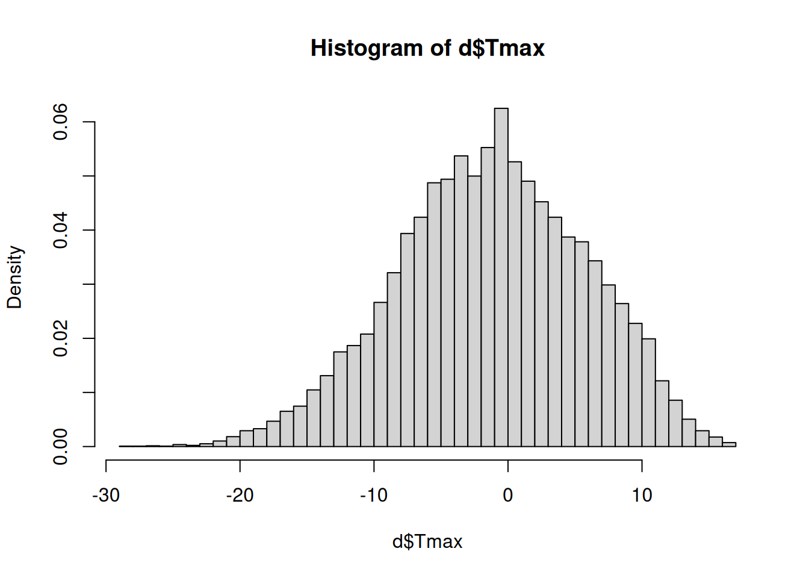
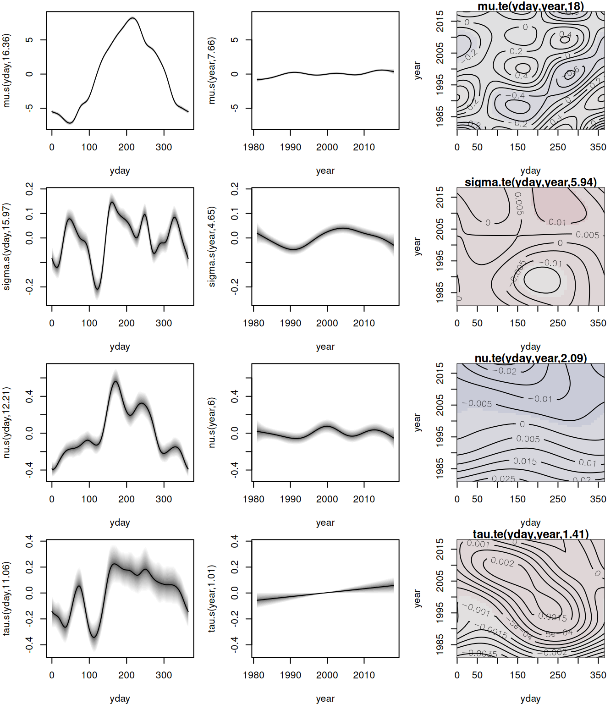
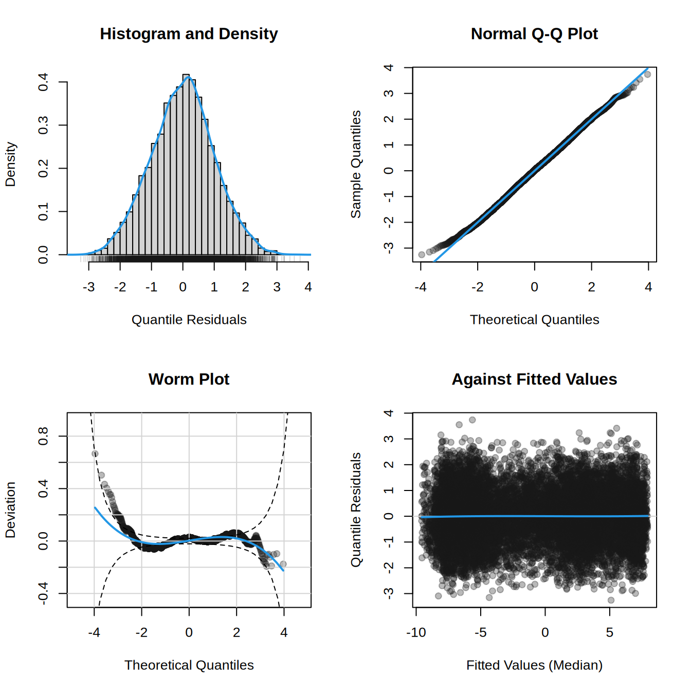
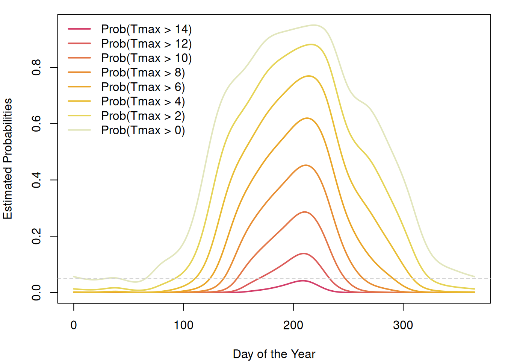

<!DOCTYPE html>
<html xmlns="http://www.w3.org/1999/xhtml" lang="en" xml:lang="en"><head>

<meta charset="utf-8">
<meta name="generator" content="quarto-1.3.450">

<meta name="viewport" content="width=device-width, initial-scale=1.0, user-scalable=yes">

<title>readme</title>

<link href="README_files/libs/quarto-html/tippy.css" rel="stylesheet">
<link href="README_files/libs/quarto-html/quarto-syntax-highlighting.css" rel="stylesheet" id="quarto-text-highlighting-styles">

<link href="README_files/libs/bootstrap/bootstrap-icons.css" rel="stylesheet">
<link href="README_files/libs/bootstrap/bootstrap.min.css" rel="stylesheet" id="quarto-bootstrap" data-mode="light">

</head>

<body class="fullcontent">

<main class="content" id="quarto-document-content">

<!-- README.md is generated from README.qmd via: quarto render README.qmd --output README.md -->
<section id="gamlss2-infrastructure-for-flexible-distributional-regression" class="level1">
<h1>gamlss2: Infrastructure for Flexible Distributional Regression</h1>
<section id="overview" class="level2">
<h2 class="anchored" data-anchor-id="overview">Overview</h2>

The primary purpose of this package is to facilitate the creation of advanced infrastructures designed to enhance the GAMLSS modeling framework. Notably, the <code>gamlss2</code> package represents a significant overhaul of its predecessor, <a href="https://cran.r-project.org/package=gamlss"><code>gamlss</code></a>, with a key emphasis on improving estimation speed and incorporating more flexible infrastructures. These enhancements enable the seamless integration of various algorithms into GAMLSS, including gradient boosting, Bayesian estimation, regression trees, and forests, fostering a more versatile and powerful modeling environment.

Moreover, the package expands its compatibility by supporting all model terms from the base R <a href="https://cran.r-project.org/package=mgcv"><code>mgcv</code></a> package. Additionally, the <code>gamlss2</code> package introduces the capability to accommodate more than four parameter families. Essentially, this means that users can now specify any type of model using these new infrastructures, making the package highly flexible and accommodating to a wide range of modeling requirements.

<ul>
<li>The main model function is <a href="https://gamlss-dev.github.io/gamlss2/man/gamlss2.html"><code>gamlss2()</code></a>.</li>
<li>The default optimizer functions is <a href="https://gamlss-dev.github.io/gamlss2/man/RS_CG.html"><code>RS()</code></a>. Optimizer functions can be exchanged.</li>
<li>Most important methods: <code>summary()</code>, <a href="https://gamlss-dev.github.io/gamlss2/man/plots.html"><code>plot()</code></a>, <a href="https://gamlss-dev.github.io/gamlss2/man/predict.gamlss2.html"><code>predict()</code></a>.</li>
<li>Easy development of new family objects, see <a href="https://gamlss-dev.github.io/gamlss2/man/gamlss2.family.html"><code>?gamlss2,family</code></a>.</li>
<li>User-specific “special” terms are possible, see <a href="https://gamlss-dev.github.io/gamlss2/man/special_terms.html"><code>?special_terms</code></a>.</li>
</ul>

For examples, please visit the manual pages.

<pre class="sourceCode r code-with-copy"><code class="sourceCode r">help(package = "gamlss2")</code><button title="Copy to Clipboard" class="code-copy-button"><i class="bi"></i></button></pre>

</section>
<section id="installation" class="level2">
<h2 class="anchored" data-anchor-id="installation">Installation</h2>

The development version of <code>gamlss2</code> can be installed via

<pre class="sourceCode r code-with-copy"><code class="sourceCode r">install.packages("gamlss2",
  repos = c("https://gamlss-dev.R-universe.dev",
            "https://cloud.R-project.org"))</code><button title="Copy to Clipboard" class="code-copy-button"><i class="bi"></i></button></pre>

</section>
<section id="licence" class="level2">
<h2 class="anchored" data-anchor-id="licence">Licence</h2>

The package is available under the <a href="https://www.gnu.org/licenses/gpl-3.0.html">General Public License version 3</a> or <a href="https://www.gnu.org/licenses/old-licenses/gpl-2.0.html">version 2</a>

</section>
<section id="illustration" class="level2">
<h2 class="anchored" data-anchor-id="illustration">Illustration</h2>

The package is designed to follow the workflow of well-established model fitting functions like <code>lm()</code> or <code>glm()</code>, i.e., the step of estimating full distributional regression models is actually not very difficult.

To illustrate the workflow using <code>gamlss2</code>, we analyze the <code>WeatherGermany</code> data,

<pre class="sourceCode r code-with-copy"><code class="sourceCode r">if(!("WeatherGermany" %in% installed.packages())) {
  install.packages('WeatherGermany',
    repos = c("https://gamlss-dev.r-universe.dev",
              "https://cloud.r-project.org"))
}
data("WeatherGermany", package = "WeatherGermany")
head(WeatherGermany)</code><button title="Copy to Clipboard" class="code-copy-button"><i class="bi"></i></button></pre>

<pre><code>  id       date Wmax pre Tmax Tmin sun name alt     lat    lon
1  1 1981-01-01   NA 1.7  3.4 -5.0  NA Aach 478 47.8413 8.8493
2  1 1981-01-02   NA 1.7  1.2 -0.4  NA Aach 478 47.8413 8.8493
3  1 1981-01-03   NA 5.4  5.4  1.0  NA Aach 478 47.8413 8.8493
4  1 1981-01-04   NA 8.8  5.6 -0.4  NA Aach 478 47.8413 8.8493
5  1 1981-01-05   NA 3.7  1.2 -2.4  NA Aach 478 47.8413 8.8493
6  1 1981-01-06   NA 4.0  1.2 -2.2  NA Aach 478 47.8413 8.8493</code></pre>

The dataset contains daily observations from weather stations across Germany. It includes the station identifier (<code>id</code>), the recording <code>date</code>, the maximum wind speed (<code>Wmax</code>, in m/s), the precipitation amount (<code>pre</code>, in mm), the maximum and minimum temperatures (<code>Tmax</code> and <code>Tmin</code>, in °C), and the number of sunshine hours (<code>sun</code>). Additionally, it provides the station’s <code>name</code>, <code>alt</code>itude (in meters above sea level), and its geographic coordinates (<code>lon</code>gitude and <code>lat</code>itude).

In this example, we use daily maximum temperature (<code>Tmax</code>) data to estimate a climatology model based on over 37 years of observations from Germany’s highest meteorological station, located at Zugspitze. Situated at an altitude of 2956 meters above sea level, this station provides a unique dataset for high-altitude climate analysis.

First, we subset the dataset to include only observations from the Zugspitze station.

<pre class="sourceCode r code-with-copy"><code class="sourceCode r">d &lt;- subset(WeatherGermany, name == "Zugspitze")</code><button title="Copy to Clipboard" class="code-copy-button"><i class="bi"></i></button></pre>

Before estimating a climatology model using <code>gamlss2</code>, it is good practice to inspect the distribution of the response variable

<pre class="sourceCode r code-with-copy"><code class="sourceCode r">hist(d$Tmax, freq = FALSE, breaks = "Scott")</code><button title="Copy to Clipboard" class="code-copy-button"><i class="bi"></i></button></pre>

The histogram suggests that the data is slightly left-skewed, with longer tails for temperatures below zero. This indicates that the commonly used normal distribution may not be the most appropriate choice for modeling daily maximum temperatures.

To address this, the <code>gamlss2</code> package provides the <a href="https://gamlss-dev.github.io/gamlss2/man/find_family.html"><code>find_family()</code></a> function, which helps identify the most suitable distribution by minimizing an information criterion, AIC by default. Here, we evaluate several continuous distributions available in the <a href="https://cran.r-project.org/package=gamlss.dist"><code>gamlss.dist</code></a> package.

<pre class="sourceCode r code-with-copy"><code class="sourceCode r">fams &lt;- find_family(d$Tmax,
  families = c(NO, TF, JSU, SEP4))</code><button title="Copy to Clipboard" class="code-copy-button"><i class="bi"></i></button></pre>

<pre><code>.. NO family
.. .. IC = 92044.1 
.. TF family
.. .. IC = 92046.12 
.. JSU family
.. .. IC = 91975.24 
.. SEP4 family
.. .. IC = 91879.66 </code></pre>

<pre class="sourceCode r code-with-copy"><code class="sourceCode r">print(fams)</code><button title="Copy to Clipboard" class="code-copy-button"><i class="bi"></i></button></pre>

<pre><code>      TF       NO      JSU     SEP4 
92046.12 92044.10 91975.24 91879.66 </code></pre>

Here, the <code>SEP4</code> family appears to provide the best fit. To further assess its suitability, we can visualize the fitted density using

<pre class="sourceCode r code-with-copy"><code class="sourceCode r">fit_family(d$Tmax, family = SEP4)</code><button title="Copy to Clipboard" class="code-copy-button"><i class="bi"></i></button></pre>

<pre><code>GAMLSS-RS iteration  1: Global Deviance = 91950.4801 eps = 0.044494     
GAMLSS-RS iteration  2: Global Deviance = 91907.9542 eps = 0.000462     
GAMLSS-RS iteration  3: Global Deviance = 91889.9353 eps = 0.000196     
GAMLSS-RS iteration  4: Global Deviance = 91880.9925 eps = 0.000097     
GAMLSS-RS iteration  5: Global Deviance = 91876.7482 eps = 0.000046     
GAMLSS-RS iteration  6: Global Deviance = 91874.399 eps = 0.000025     
GAMLSS-RS iteration  7: Global Deviance = 91872.4447 eps = 0.000021     
GAMLSS-RS iteration  8: Global Deviance = 91871.6641 eps = 0.000008     </code></pre>

After identifying a suitable distributional model, we can now incorporate covariates to estimate a full GAMLSS. Since temperature data exhibits a strong seasonal pattern, as illustrated in the following scatterplot

<pre class="sourceCode r code-with-copy"><code class="sourceCode r">d$yday &lt;- as.POSIXlt(d$date)$yday</code><button title="Copy to Clipboard" class="code-copy-button"><i class="bi"></i></button></pre>

It is essential to include a model term that captures these seasonal effects. The <code>gamlss2</code> package supports all model terms from the <a href="https://cran.r-project.org/package=mgcv"><code>mgcv</code></a> package, allowing us to use the <code>s()</code> constructor to model seasonality.

Additionally, we include a time trend to examine whether maximum temperatures have increased over the observed period. In the full GAMLSS model, each parameter of the selected <code>SEP4</code> distribution is estimated separately. To incorporate the time trend, we first create a new covariate, <code>year</code>, representing the long-term temporal effect

<pre class="sourceCode r code-with-copy"><code class="sourceCode r">d$year &lt;- as.POSIXlt(d$date)$year + 1900</code><button title="Copy to Clipboard" class="code-copy-button"><i class="bi"></i></button></pre>

Next, we define the model formula for the four parameters of the <code>SEP4</code> distribution.

<pre class="sourceCode r code-with-copy"><code class="sourceCode r">f &lt;- Tmax ~ s(yday, bs = "cc", k = 20) + s(year) + te(yday, year, bs = c("cc", "cr")) |
  s(yday, bs = "cc", k = 20) + s(year) + te(yday, year, bs = c("cc", "cr")) |
  s(yday, bs = "cc", k = 20) + s(year) + te(yday, year, bs = c("cc", "cr")) |
  s(yday, bs = "cc", k = 20) + s(year) + te(yday, year, bs = c("cc", "cr"))</code><button title="Copy to Clipboard" class="code-copy-button"><i class="bi"></i></button></pre>

In this formula, the vertical bars <code>|</code> separate the specifications for each parameter of the <code>SEP4</code> distribution. The argument <code>bs = "cc"</code> specifies a cyclical spline to account for the seasonal effect, ensuring continuity at the beginning and end of the year, and argument <code>k</code> controls the dimension of the basis used to represent the smooth term.

Finally, we estimate the model using

<pre class="sourceCode r code-with-copy"><code class="sourceCode r">b &lt;- gamlss2(f, data = d, family = SEP4)</code><button title="Copy to Clipboard" class="code-copy-button"><i class="bi"></i></button></pre>

<pre><code>GAMLSS-RS iteration  1: Global Deviance = 79918.3054 eps = 0.169526     
GAMLSS-RS iteration  2: Global Deviance = 79804.3251 eps = 0.001426     
GAMLSS-RS iteration  3: Global Deviance = 79759.9851 eps = 0.000555     
GAMLSS-RS iteration  4: Global Deviance = 79745.0554 eps = 0.000187     
GAMLSS-RS iteration  5: Global Deviance = 79738.3587 eps = 0.000083     
GAMLSS-RS iteration  6: Global Deviance = 79736.4781 eps = 0.000023     
GAMLSS-RS iteration  7: Global Deviance = 79735.2054 eps = 0.000015     
GAMLSS-RS iteration  8: Global Deviance = 79734.6366 eps = 0.000007     </code></pre>

This approach allows us to flexibly capture both seasonal patterns and long-term trends in daily maximum temperatures.

After estimating the model, we can examine the model summary using

<pre class="sourceCode r code-with-copy"><code class="sourceCode r">summary(b)</code><button title="Copy to Clipboard" class="code-copy-button"><i class="bi"></i></button></pre>

<pre><code>Call:
gamlss2(formula = f, data = d, family = SEP4)
---
Family: SEP4 
Link function: mu = identity, sigma = log, nu = log, tau = log
*--------
Parameter: mu 
---
Coefficients:
            Estimate Std. Error t value Pr(&gt;|t|)    
(Intercept)  -0.9380     0.1507  -6.224    5e-10 ***
---
Smooth terms:
    s(yday) s(year) te(yday,year)
edf 16.3620  7.6634        17.997
*--------
Parameter: sigma 
---
Coefficients:
            Estimate Std. Error t value Pr(&gt;|t|)    
(Intercept)  1.88151    0.00144    1307   &lt;2e-16 ***
---
Smooth terms:
    s(yday) s(year) te(yday,year)
edf 15.9695  4.6506        5.9388
*--------
Parameter: nu 
---
Coefficients:
            Estimate Std. Error t value Pr(&gt;|t|)    
(Intercept)  0.63884    0.02157   29.62   &lt;2e-16 ***
---
Smooth terms:
    s(yday) s(year) te(yday,year)
edf 12.2077  6.0049        2.0948
*--------
Parameter: tau 
---
Coefficients:
            Estimate Std. Error t value Pr(&gt;|t|)    
(Intercept) 1.027653   0.009979     103   &lt;2e-16 ***
---
Signif. codes:  0 '***' 0.001 '**' 0.01 '*' 0.05 '.' 0.1 ' ' 1
---
Smooth terms:
    s(yday) s(year) te(yday,year)
edf  11.060   1.013        1.4077
*--------
n = 13665 df =  106.37 res.df =  13558.63
Deviance = 79734.6366 Null Dev. Red. = 13.21%
AIC = 79947.3743 elapsed = 20.67sec</code></pre>

The summary output is structured similarly to those of <code>lm()</code> and <code>glm()</code>, with the key difference being that it provides results for all parameters of the selected distribution. Specifically, it displays the estimated linear coefficients (in this case, primarily the intercepts), along with the effective degrees of freedom for each smooth term. Additionally, the AIC and deviance values are reported.

To extract the AIC separately, we use

<pre class="sourceCode r code-with-copy"><code class="sourceCode r">AIC(b)</code><button title="Copy to Clipboard" class="code-copy-button"><i class="bi"></i></button></pre>

<pre><code>[1] 79947.37</code></pre>

Similarly, the log-likelihood can be obtained with

<pre class="sourceCode r code-with-copy"><code class="sourceCode r">logLik(b)</code><button title="Copy to Clipboard" class="code-copy-button"><i class="bi"></i></button></pre>

<pre><code>'log Lik.' -39867.32 (df=106.3689)</code></pre>

<pre class="sourceCode r code-with-copy"><code class="sourceCode r">logLik(b, newdata = d)</code><button title="Copy to Clipboard" class="code-copy-button"><i class="bi"></i></button></pre>

<pre><code>'log Lik.' -39867.32 (df=106.3689)</code></pre>

Here we use the <code>newdata</code> argument just to show, that the log-likelihood can also be evaluated on, e.g., out-of-sample data.

Additionally, the estimated effects can be visualized instantly using

<pre class="sourceCode r code-with-copy"><code class="sourceCode r">plot(b, which = "effects")</code><button title="Copy to Clipboard" class="code-copy-button"><i class="bi"></i></button></pre>

This plot provides a direct visualization of the smooth effects included in the model, helping to interpret seasonal variations and long-term trends efficiently.

To assess the calibration of the estimated model, we examine the quantile residuals using a histogram, Q-Q plot, and worm plot.

<pre class="sourceCode r code-with-copy"><code class="sourceCode r">plot(b, which = "resid")</code><button title="Copy to Clipboard" class="code-copy-button"><i class="bi"></i></button></pre>

These diagnostic plots indicate that the model is well-calibrated when using the <code>SEP4</code> distribution, demonstrating a good fit to the observed data.

Model predictions can be obtained for various statistical quantities, including the mean, quantiles, probability density function (PDF), and cumulative distribution function (CDF). To illustrate this, we first examine the marginal effect of the long-term time trend. For this purpose, we create a new data frame containing only the years of interest.

<pre class="sourceCode r code-with-copy"><code class="sourceCode r">nd &lt;- data.frame("year" = 1981:2018, "yday" = 182)</code><button title="Copy to Clipboard" class="code-copy-button"><i class="bi"></i></button></pre>

Next, we predict quantiles by first computing the estimated parameters

<pre class="sourceCode r code-with-copy"><code class="sourceCode r">par &lt;- predict(b, newdata = nd)</code><button title="Copy to Clipboard" class="code-copy-button"><i class="bi"></i></button></pre>

To compute, e.g., the 50% quantile (median), we extract the <a href="https://gamlss-dev.github.io/gamlss2/man/gamlss2.family.html"><code>gamlss2.family</code></a> of the fitted model and call the corresponding <code>$q()</code> (quantile) function provided by the family.

<pre class="sourceCode r code-with-copy"><code class="sourceCode r">q50 &lt;- family(b)$q(0.5, par)</code><button title="Copy to Clipboard" class="code-copy-button"><i class="bi"></i></button></pre>

Similarly, we can compute the 10% and 90% quantiles

<pre class="sourceCode r code-with-copy"><code class="sourceCode r">q10 &lt;- family(b)$q(0.1, par)
q90 &lt;- family(b)$q(0.9, par)</code><button title="Copy to Clipboard" class="code-copy-button"><i class="bi"></i></button></pre>

Finally, we visualize the long-term trend in temperature.

<pre class="sourceCode r code-with-copy"><code class="sourceCode r">matplot(nd$year, cbind(q10, q50, q90), type = "l",
  lwd = 2, xlab = "Year", ylab = "Estimated Quantiles")</code><button title="Copy to Clipboard" class="code-copy-button"><i class="bi"></i></button></pre>

The plot reveals an upward trend in the median temperature over time, highlighting the effects of long-term climate change.

To visualize exceedance probabilities for the 2019 season, we use the <code>$p()</code> function of the family object. For example, we can compute the probabilities of maximum temperatures exceeding 10, 11, 12, 13, and 14 °C as follows

<pre class="sourceCode r code-with-copy"><code class="sourceCode r">nd &lt;- data.frame("year" = 2019, "yday" = 0:365)
par &lt;- predict(b, newdata = nd)
Tmax &lt;- rev(seq(0, 14, by = 2))
probs &lt;- sapply(Tmax, function(t) 1 - family(b)$p(t, par))
colnames(probs) &lt;- paste0("Prob(Tmax &gt; ", Tmax, ")")
head(probs)</code><button title="Copy to Clipboard" class="code-copy-button"><i class="bi"></i></button></pre>

<pre><code>     Prob(Tmax &gt; 14) Prob(Tmax &gt; 12) Prob(Tmax &gt; 10) Prob(Tmax &gt; 8)
[1,]    1.590061e-12    5.501117e-10    7.673712e-08   4.605888e-06
[2,]    1.635692e-12    5.493598e-10    7.520458e-08   4.469749e-06
[3,]    1.630585e-12    5.369963e-10    7.269465e-08   4.302274e-06
[4,]    1.585621e-12    5.161699e-10    6.952153e-08   4.115322e-06
[5,]    1.514233e-12    4.901235e-10    6.598375e-08   3.919732e-06
[6,]    1.428635e-12    4.618508e-10    6.234650e-08   3.725021e-06
     Prob(Tmax &gt; 6) Prob(Tmax &gt; 4) Prob(Tmax &gt; 2) Prob(Tmax &gt; 0)
[1,]   0.0001275031    0.001753963     0.01299744     0.05663021
[2,]   0.0001233908    0.001701366     0.01267788     0.05562356
[3,]   0.0001188968    0.001647312     0.01236082     0.05464662
[4,]   0.0001142025    0.001592977     0.01204944     0.05370176
[5,]   0.0001094721    0.001539443     0.01174679     0.05279154
[6,]   0.0001048512    0.001487695     0.01145582     0.05191868</code></pre>

To illustrate these exceedance probabilities, we plot them over the course of the year

<pre class="sourceCode r code-with-copy"><code class="sourceCode r">col &lt;- colorspace::heat_hcl(ncol(probs))</code><button title="Copy to Clipboard" class="code-copy-button"><i class="bi"></i></button></pre>

The plot reveals that even at this high-altitude station, the probability of <code>Tmax</code> &gt; 14°C reaches approximately 5% during summer. This is particularly striking considering that the Zugspitze once had a permanent glacier field, emphasizing the impact of rising temperatures in this region. Likewise, the probability of <code>Tmax</code> &gt; 0°C during the winter months is also about 5%, highlighting significant temperature patterns.

</section>
</section>

</main>
<!-- /main column -->

 <!-- /content -->

</body></html>