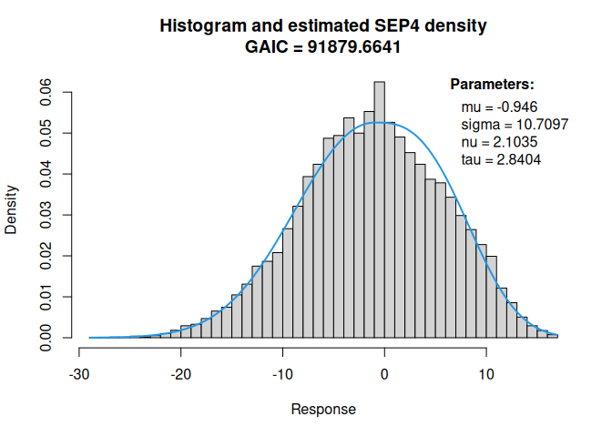
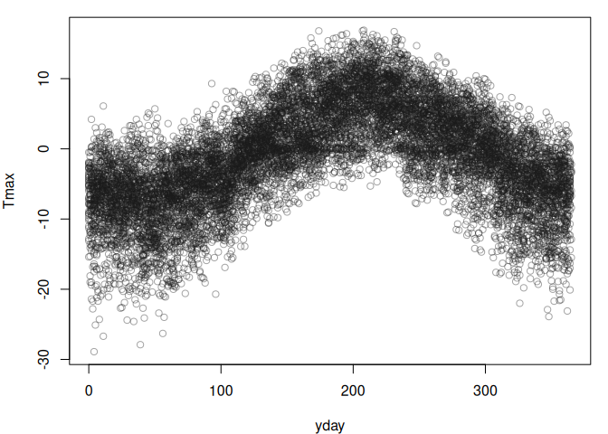
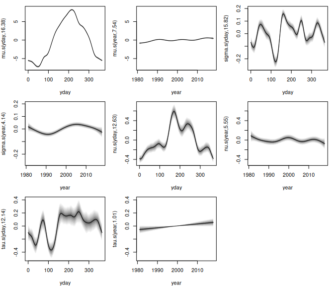
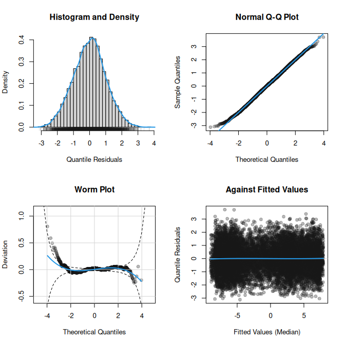
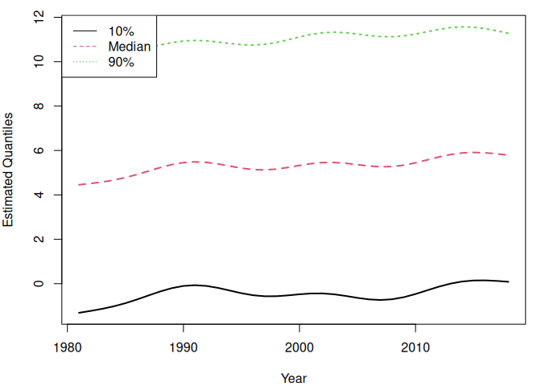

<!-- README.md is generated from README.qmd via: quarto render README.qmd --to gfm -->

# gamlss2: Infrastructure for Flexible Distributional Regression

## Overview

The primary purpose of this package is to facilitate the creation of
advanced infrastructures designed to enhance the GAMLSS modeling
framework. Notably, the `gamlss2` package represents a significant
overhaul of its predecessor,
[`gamlss`](https://cran.r-project.org/package=gamlss), with a key
emphasis on improving estimation speed and incorporating more flexible
infrastructures. These enhancements enable the seamless integration of
various algorithms into GAMLSS, including gradient boosting, Bayesian
estimation, regression trees, and forests, fostering a more versatile
and powerful modeling environment.

Moreover, the package expands its compatibility by supporting all model
terms from the base R [`mgcv`](https://cran.r-project.org/package=mgcv)
package. Additionally, the `gamlss2` package introduces the capability
to accommodate more than four parameter families. Essentially, this
means that users can now specify any type of model using these new
infrastructures, making the package highly flexible and accommodating to
a wide range of modeling requirements.

- The main model function is
  [`gamlss2()`](https://gamlss-dev.github.io/gamlss2/man/gamlss2.html).
- The default optimizer functions is
  [`RS()`](https://gamlss-dev.github.io/gamlss2/man/RS_CG.html).
  Optimizer functions can be exchanged.
- Most important methods: `summary()`,
  [`plot()`](https://gamlss-dev.github.io/gamlss2/man/plots.html),
  [`predict()`](https://gamlss-dev.github.io/gamlss2/man/predict.gamlss2.html).
- Easy development of new family objects, see
  [`?gamlss2,family`](https://gamlss-dev.github.io/gamlss2/man/gamlss2.family.html).
- User-specific “special” terms are possible, see
  [`?special_terms`](https://gamlss-dev.github.io/gamlss2/man/special_terms.html).

For examples, please visit the manual pages.

``` r
help(package = "gamlss2")
```

## Installation

The development version of `gamlss2` can be installed via

``` r
install.packages("gamlss2",
  repos = c("https://gamlss-dev.R-universe.dev",
            "https://cloud.R-project.org"))
```

## Licence

The package is available under the [General Public License version
3](https://www.gnu.org/licenses/gpl-3.0.html) or [version
2](https://www.gnu.org/licenses/old-licenses/gpl-2.0.html)

## Illustration

The package is designed to follow the workflow of well-established model
fitting functions like `lm()` or `glm()`, i.e., the step of estimating
full distributional regression models is actually not very difficult.

To illustrate the workflow using `gamlss2`, we analyze the
`WeatherGermany` data,

``` r
if(!("WeatherGermany" %in% installed.packages())) {
  install.packages('WeatherGermany',
    repos = c("https://gamlss-dev.r-universe.dev",
              "https://cloud.r-project.org"))
}
data("WeatherGermany", package = "WeatherGermany")
head(WeatherGermany)
```

      id       date Wmax pre Tmax Tmin sun name alt     lat    lon
    1  1 1981-01-01   NA 1.7  3.4 -5.0  NA Aach 478 47.8413 8.8493
    2  1 1981-01-02   NA 1.7  1.2 -0.4  NA Aach 478 47.8413 8.8493
    3  1 1981-01-03   NA 5.4  5.4  1.0  NA Aach 478 47.8413 8.8493
    4  1 1981-01-04   NA 8.8  5.6 -0.4  NA Aach 478 47.8413 8.8493
    5  1 1981-01-05   NA 3.7  1.2 -2.4  NA Aach 478 47.8413 8.8493
    6  1 1981-01-06   NA 4.0  1.2 -2.2  NA Aach 478 47.8413 8.8493

The dataset contains daily observations from weather stations across
Germany. It includes the station identifier (`id`), the recording
`date`, the maximum wind speed (`Wmax`, in m/s), the precipitation
amount (`pre`, in mm), the maximum and minimum temperatures (`Tmax` and
`Tmin`, in °C), and the number of sunshine hours (`sun`). Additionally,
it provides the station’s `name`, `alt`itude (in meters above sea
level), and its geographic coordinates (`lon`gitude and `lat`itude).

In this example, we use daily maximum temperature (`Tmax`) data to
estimate a climatology model based on over 37 years of observations from
Germany’s highest meteorological station, located at Zugspitze. Situated
at an altitude of 2956 meters above sea level, this station provides a
unique dataset for high-altitude climate analysis.

First, we subset the dataset to include only observations from the
Zugspitze station.

``` r
d <- subset(WeatherGermany, name == "Zugspitze")
```

Before estimating a climatology model using `gamlss2`, it is good
practice to inspect the distribution of the response variable

``` r
hist(d$Tmax, freq = FALSE, breaks = "Scott")
```


The histogram suggests that the data is slightly left-skewed, with
longer tails for temperatures below zero. This indicates that the
commonly used normal distribution may not be the most appropriate choice
for modeling daily maximum temperatures.

To address this, the `gamlss2` package provides the
[`find_family()`](https://gamlss-dev.github.io/gamlss2/man/find_family.html)
function, which helps identify the most suitable distribution by
minimizing an information criterion, AIC by default. Here, we evaluate
several continuous distributions available in the
[`gamlss.dist`](https://cran.r-project.org/package=gamlss.dist) package.

``` r
fams <- find_family(d$Tmax,
  families = c(NO, TF, JSU, SEP4))
```

    .. NO family
    .. .. IC = 92044.1 
    .. TF family
    .. .. IC = 92046.12 
    .. JSU family
    .. .. IC = 91975.24 
    .. SEP4 family
    .. .. IC = 91879.66 

``` r
print(fams)
```

          TF       NO      JSU     SEP4 
    92046.12 92044.10 91975.24 91879.66 

Here, the SEP4 family appears to provide the best fit. To further assess
its suitability, we can visualize the fitted density using

``` r
fit_family(d$Tmax, family = SEP4)
```

    GAMLSS-RS iteration  1: Global Deviance = 91950.4801 eps = 0.044494     
    GAMLSS-RS iteration  2: Global Deviance = 91907.9542 eps = 0.000462     
    GAMLSS-RS iteration  3: Global Deviance = 91889.9353 eps = 0.000196     
    GAMLSS-RS iteration  4: Global Deviance = 91880.9925 eps = 0.000097     
    GAMLSS-RS iteration  5: Global Deviance = 91876.7482 eps = 0.000046     
    GAMLSS-RS iteration  6: Global Deviance = 91874.399 eps = 0.000025     
    GAMLSS-RS iteration  7: Global Deviance = 91872.4447 eps = 0.000021     
    GAMLSS-RS iteration  8: Global Deviance = 91871.6641 eps = 0.000008     



After identifying a suitable distributional model, we can now
incorporate covariates to estimate a full GAMLSS. Since temperature data
exhibits a strong seasonal pattern, as illustrated in the following
scatterplot

``` r
d$yday <- as.POSIXlt(d$date)$yday
```



It is essential to include a model term that captures these seasonal
effects. The
`gamlss2 package  supports all model terms from the [`mgcv`](https://cran.r-project.org/package=mgcv) package,  allowing us to use the`s()\`
constructor to model seasonality.

Additionally, we include a time trend to examine whether maximum
temperatures have increased over the observed period. In the full GAMLSS
model, each parameter of the selected `SEP4` distribution is estimated
separately. To incorporate the time trend, we first create a new
covariate, `year`, representing the long-term temporal effect

``` r
d$year <- as.POSIXlt(d$date)$year + 1900
```

Next, we define the model formula for the four parameters of the `SEP4`
distribution.

``` r
f <- Tmax ~ s(yday, bs = "cc", k = 20) + s(year) |
  s(yday, bs = "cc", k = 20) + s(year) |
  s(yday, bs = "cc", k = 20) + s(year) |
  s(yday, bs = "cc", k = 20) + s(year)
```

In this formula, the vertical bars `|` separate the specifications for
each parameter of the `SEP4` distribution. The argument `bs = "cc"`
specifies a cyclical spline to account for the seasonal effect, ensuring
continuity at the beginning and end of the year, and argument `k`
controls the dimension of the basis used to represent the smooth term.

Finally, we estimate the model using

``` r
b <- gamlss2(f, data = d, family = SEP4)
```

    GAMLSS-RS iteration  1: Global Deviance = 80024.4293 eps = 0.168423     
    GAMLSS-RS iteration  2: Global Deviance = 79913.7143 eps = 0.001383     
    GAMLSS-RS iteration  3: Global Deviance = 79877.0442 eps = 0.000458     
    GAMLSS-RS iteration  4: Global Deviance = 79864.0999 eps = 0.000162     
    GAMLSS-RS iteration  5: Global Deviance = 79858.1657 eps = 0.000074     
    GAMLSS-RS iteration  6: Global Deviance = 79856.0447 eps = 0.000026     
    GAMLSS-RS iteration  7: Global Deviance = 79854.4101 eps = 0.000020     
    GAMLSS-RS iteration  8: Global Deviance = 79853.9545 eps = 0.000005     

This approach allows us to flexibly capture both seasonal patterns and
long-term trends in daily maximum temperatures.

After estimating the model, we can examine the model summary using

``` r
summary(b)
```

    Call:
    gamlss2(formula = f, data = d, family = SEP4)
    ---
    Family: SEP4 
    Link function: mu = identity, sigma = log, nu = log, tau = log
    *--------
    Parameter: mu 
    ---
    Coefficients:
                Estimate Std. Error t value Pr(>|t|)    
    (Intercept)  -0.9391     0.1468  -6.398 1.63e-10 ***
    ---
    Smooth terms:
        s(yday) s(year)
    edf  16.382   7.543
    *--------
    Parameter: sigma 
    ---
    Coefficients:
                Estimate Std. Error t value Pr(>|t|)    
    (Intercept) 1.886075   0.001932   976.2   <2e-16 ***
    ---
    Smooth terms:
        s(yday) s(year)
    edf  15.823  4.1399
    *--------
    Parameter: nu 
    ---
    Coefficients:
                Estimate Std. Error t value Pr(>|t|)    
    (Intercept)  0.64172    0.02103   30.51   <2e-16 ***
    ---
    Smooth terms:
        s(yday) s(year)
    edf  12.634  5.5508
    *--------
    Parameter: tau 
    ---
    Coefficients:
                Estimate Std. Error t value Pr(>|t|)    
    (Intercept) 1.028989   0.009557   107.7   <2e-16 ***
    ---
    Signif. codes:  0 '***' 0.001 '**' 0.01 '*' 0.05 '.' 0.1 ' ' 1
    ---
    Smooth terms:
        s(yday) s(year)
    edf  12.144  1.0062
    *--------
    n = 13665 df =  79.22 res.df =  13585.78
    Deviance = 79853.9545 Null Dev. Red. = 13.08%
    AIC = 80012.3985 elapsed = 26.02sec

The summary output is structured similarly to those of `lm()` and
`glm()`, with the key difference being that it provides results for all
parameters of the selected distribution. Specifically, it displays the
estimated linear coefficients (in this case, primarily the intercepts),
along with the effective degrees of freedom for each smooth term.
Additionally, the AIC and deviance values are reported.

To extract the AIC separately, we use

``` r
AIC(b)
```

    [1] 80012.4

Similarly, the log-likelihood can be obtained with

``` r
logLik(b)
```

    'log Lik.' -39926.98 (df=79.22199)

``` r
logLik(b, newdata = d)
```

    'log Lik.' -39926.98 (df=79.22199)

Here we use the `newdata` argument just to show, that the log-likelihood
can also be evaluated on, e.g., out-of-sample data.

Additionally, the estimated effects can be visualized instantly using

``` r
plot(b, which = "effects")
```



This plot provides a direct visualization of the smooth effects included
in the model, helping to interpret seasonal variations and long-term
trends efficiently.

To assess the calibration of the estimated model, we examine the
quantile residuals using a histogram, Q-Q plot, and worm plot.

``` r
plot(b, which = "resid")
```



These diagnostic plots indicate that the model is well-calibrated when
using the `SEP4` distribution, demonstrating a good fit to the observed
data.

Model predictions can be obtained for various statistical quantities,
including the mean, quantiles, probability density function (PDF), and
cumulative distribution function (CDF). To illustrate this, we first
examine the marginal effect of the long-term time trend. For this
purpose, we create a new data frame containing only the years of
interest.

``` r
nd <- data.frame("year" = 1981:2018, "yday" = 182)
```

Next, we predict quantiles by first computing the estimated parameters

``` r
par <- predict(b, newdata = nd)
```

To compute, e.g., the 50% quantile (median), we extract the
[`gamlss2.family`](https://gamlss-dev.github.io/gamlss2/man/gamlss2.family.html)
of the fitted model and call the corresponding `$q()` (quantile)
function provided by the family.

``` r
q50 <- family(b)$q(0.5, par)
```

Similarly, we can compute the 10% and 90% quantiles

``` r
q10 <- family(b)$q(0.1, par)
q90 <- family(b)$q(0.9, par)
```

Finally, we visualize the long-term trend in temperature.

``` r
matplot(nd$year, cbind(q10, q50, q90), type = "l",
  lwd = 2, xlab = "Year", ylab = "Estimated Quantiles")
```



The plot reveals an upward trend in the median temperature over time,
highlighting the effects of long-term climate change.

To visualize exceedance probabilities for the 2019 season, we use the
`$p()` function of the family object. For example, we can compute the
probabilities of maximum temperatures exceeding 10, 11, 12, 13, and 14
°C as follows

``` r
nd <- data.frame("year" = 2019, "yday" = 0:365)
par <- predict(b, newdata = nd)
Tmax <- rev(seq(0, 14, by = 2))
probs <- sapply(Tmax, function(t) 1 - family(b)$p(t, par))
colnames(probs) <- paste0("Prob(Tmax > ", Tmax, ")")
head(probs)
```

         Prob(Tmax > 14) Prob(Tmax > 12) Prob(Tmax > 10) Prob(Tmax > 8)
    [1,]    1.076916e-13    7.994927e-11    2.015706e-08   1.885932e-06
    [2,]    1.202372e-13    8.379741e-11    2.024026e-08   1.845235e-06
    [3,]    1.285638e-13    8.538326e-11    1.997686e-08   1.788527e-06
    [4,]    1.331157e-13    8.509593e-11    1.945703e-08   1.721421e-06
    [5,]    1.341149e-13    8.345702e-11    1.877488e-08   1.649196e-06
    [6,]    1.328937e-13    8.103096e-11    1.802007e-08   1.576599e-06
         Prob(Tmax > 6) Prob(Tmax > 4) Prob(Tmax > 2) Prob(Tmax > 0)
    [1,]   7.184322e-05    0.001228708    0.010461880     0.04946567
    [2,]   6.942085e-05    0.001184324    0.010125835     0.04824358
    [3,]   6.679725e-05    0.001140251    0.009804780     0.04709746
    [4,]   6.408441e-05    0.001097238    0.009500008     0.04602442
    [5,]   6.138384e-05    0.001055977    0.009212863     0.04502230
    [6,]   5.878548e-05    0.001017096    0.008944721     0.04408959

To illustrate these exceedance probabilities, we plot them over the
course of the year

``` r
col <- colorspace::heat_hcl(ncol(probs))
```


The plot reveals that even at this high-altitude station, the
probability of `Tmax` \> 14°C reaches approximately 5% during summer.
This is particularly striking considering that the Zugspitze once had a
permanent glacier field, emphasizing the impact of rising temperatures
in this region. Likewise, the probability of `Tmax` \> 0°C during the
winter months is also about 5%, highlighting significant temperature
patterns.
