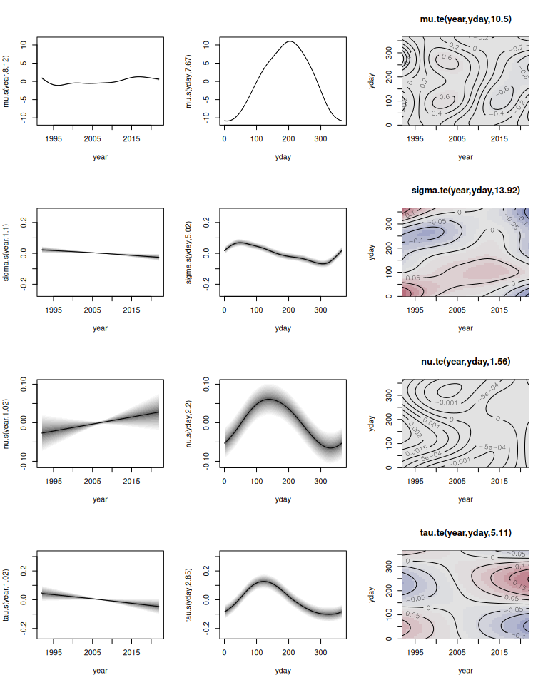
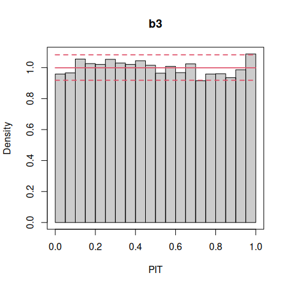
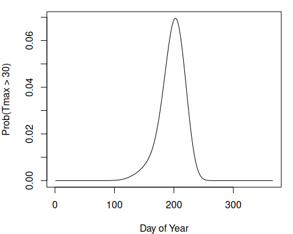

<!-- README.md is generated from README.qmd via: quarto render README.qmd --to gfm -->


# gamlss2: Infrastructure for Flexible Distributional Regression

## Overview

The primary purpose of this package is to facilitate the creation of
advanced infrastructures designed to enhance the GAMLSS modeling
framework. Notably, the `gamlss2` package represents a significant
overhaul of its predecessor,
[`gamlss`](https://cran.r-project.org/package=gamlss), with a key
emphasis on improving estimation speed and incorporating more flexible
infrastructures. These enhancements enable the seamless integration of
various algorithms into GAMLSS, including gradient boosting, Bayesian
estimation, regression trees, and forests, fostering a more versatile
and powerful modeling environment.

Moreover, the package expands its compatibility by supporting all model
terms from the base R [`mgcv`](https://cran.r-project.org/package=mgcv)
package. Additionally, the `gamlss2` package introduces the capability
to accommodate more than four parameter families. Essentially, this
means that users can now specify any type of model using these new
infrastructures, making the package highly flexible and accommodating to
a wide range of modeling requirements.

- The main model function is
  [`gamlss2()`](https://gamlss-dev.github.io/gamlss2/man/gamlss2.html).
- The default optimizer functions is
  [`RS()`](https://gamlss-dev.github.io/gamlss2/man/RS_CG.html).
  Optimizer functions can be exchanged.
- Most important methods: `summary()`,
  [`plot()`](https://gamlss-dev.github.io/gamlss2/man/plots.html),
  [`predict()`](https://gamlss-dev.github.io/gamlss2/man/predict.gamlss2.html).
- Easy development of new family objects, see
  [`?gamlss2,family`](https://gamlss-dev.github.io/gamlss2/man/gamlss2.family.html).
- User-specific “special” terms are possible, see
  [`?special_terms`](https://gamlss-dev.github.io/gamlss2/man/special_terms.html).

For examples, please visit the manual pages.

``` r
help(package = "gamlss2")
```

## Installation

The development version of `gamlss2` can be installed via

``` r
install.packages("gamlss2",
  repos = c("https://gamlss-dev.R-universe.dev",
            "https://cloud.R-project.org"))
```

## Licence

The package is available under the [General Public License version
3](https://www.gnu.org/licenses/gpl-3.0.html) or [version
2](https://www.gnu.org/licenses/old-licenses/gpl-2.0.html)

## Illustration

The package is designed to follow the workflow of well-established model
fitting functions like `lm()` or `glm()`, i.e., the step of estimating
full distributional regression models is actually not very difficult.

We illustrate how `gamlss2` builds on the established `gamlss` framework
by modeling daily maximum temperature (`Tmax`) at Munich Airport (MUC)
to estimate the probability of “heat days” (`Tmax`
$\geq 30^\circ\text{C}$). Heat days can have serious impacts by
stressing highways and railways, increasing the load on healthcare
facilities, and affecting airport operations. Using 30 years of
historical `Tmax` data, we fit a flexible distributional regression
model that captures the full conditional distribution of daily
temperatures. By evaluating this fitted distribution at the
$30^\circ\text{C}$ threshold, we obtain heat-day probabilities. Required
packages can be loaded by

``` r
if(!("gamlss" %in% installed.packages())) {
  install.packages("gamlss")
}
library("gamlss")
library("gamlss2")
```

The data comes from the same R-universe as `gamlss2` and is loaded with

``` r
if(!("WeatherGermany" %in% installed.packages())) {
  install.packages('WeatherGermany',
    repos = c("https://gamlss-dev.r-universe.dev",
              "https://cloud.r-project.org"))
}
data("WeatherGermany", package = "WeatherGermany")
MUC <- subset(WeatherGermany, id == 1262)
```

We find that the four-parameter `SEP` family fits the marginal
distribution of `Tmax` quite well. To estimate a full distributional
model, we specify the following additive predictor

$\eta = \beta_0 + f_1(\texttt{year}) + f_2(yday) + f_3(year, yday)$

for each parameter. Here, $f_1( \cdot )$ captures the long-term
trend, $f_2( \cdot )$ models seasonal variation, and
$f_3( \cdot, \cdot )$ represents a time-varying seasonal effect. The
required variables can be added to the data by

``` r
MUC$year <- as.POSIXlt(MUC$date)$year + 1900
MUC$yday <- as.POSIXlt(MUC$date)$yday
```

In `gamlss`, model estimation is performed via

``` r
if(!("gamlss.add" %in% installed.packages())) {
  install.packages("gamlss.add")
}
library("gamlss.add")
```

``` r
f1 <- Tmax ~ ga(~ s(year) + s(yday, bs = "cc") +
  te(year, yday, bs = c("cr", "cc")))
b1 <- gamlss(f1, family = SEP,
  data = MUC[, c("Tmax", "year", "yday")])
```

    GAMLSS-RS iteration 1: Global Deviance = 65081.31 
    GAMLSS-RS iteration 2: Global Deviance = 64953.19 
    GAMLSS-RS iteration 3: Global Deviance = 64893.26 
    GAMLSS-RS iteration 4: Global Deviance = 64869.21 
    GAMLSS-RS iteration 5: Global Deviance = 64859.01 
    GAMLSS-RS iteration 6: Global Deviance = 64854.42 
    GAMLSS-RS iteration 7: Global Deviance = 64852.19 
    GAMLSS-RS iteration 8: Global Deviance = 64850.94 
    GAMLSS-RS iteration 9: Global Deviance = 64850.14 
    GAMLSS-RS iteration 10: Global Deviance = 64849.54 
    GAMLSS-RS iteration 11: Global Deviance = 64849.04 
    GAMLSS-RS iteration 12: Global Deviance = 64848.58 
    GAMLSS-RS iteration 13: Global Deviance = 64848.13 
    GAMLSS-RS iteration 14: Global Deviance = 64847.73 
    GAMLSS-RS iteration 15: Global Deviance = 64847.33 
    GAMLSS-RS iteration 16: Global Deviance = 64846.94 
    GAMLSS-RS iteration 17: Global Deviance = 64846.56 
    GAMLSS-RS iteration 18: Global Deviance = 64846.19 
    GAMLSS-RS iteration 19: Global Deviance = 64845.83 
    GAMLSS-RS iteration 20: Global Deviance = 64845.48 

    Warning in RS(): Algorithm RS has not yet converged

This setup requires loading the `gamlss.add` package to access
`mgcv`-based smooth terms. Estimation takes 20 iterations of the
backfitting algorithm (without full convergence) and about 44 seconds on
a 64-bit Linux system. Moreover, `gamlss()` requires that the input data
contains no `NA` values. In `gamlss2` the model can be specified
directly, following `mgcv` syntax

``` r
f2 <- Tmax ~ s(year) + s(yday, bs = "cc") +
  te(year, yday, bs = c("cr", "cc"))
b2 <- gamlss2(f2, family = SEP, data = MUC)
```

    GAMLSS-RS iteration  1: Global Deviance = 65324.7244 eps = 0.572868     
    GAMLSS-RS iteration  2: Global Deviance = 65122.8496 eps = 0.003090     
    GAMLSS-RS iteration  3: Global Deviance = 64958.3544 eps = 0.002525     
    GAMLSS-RS iteration  4: Global Deviance = 64895.5748 eps = 0.000966     
    GAMLSS-RS iteration  5: Global Deviance = 64870.287 eps = 0.000389     
    GAMLSS-RS iteration  6: Global Deviance = 64859.484 eps = 0.000166     
    GAMLSS-RS iteration  7: Global Deviance = 64854.7149 eps = 0.000073     
    GAMLSS-RS iteration  8: Global Deviance = 64852.3536 eps = 0.000036     
    GAMLSS-RS iteration  9: Global Deviance = 64851.0278 eps = 0.000020     
    GAMLSS-RS iteration 10: Global Deviance = 64850.16 eps = 0.000013     
    GAMLSS-RS iteration 11: Global Deviance = 64849.5251 eps = 0.000009     

This model converges in 11 iterations and requires only about 2 seconds
of computation time, yielding a similar deviance (small differences
arise due to differences in smoothing parameter optimization). In many
applications, it is desirable to use the same predictor structure for
all distribution parameters. In `gamlss`, this requires specifying
identical formulas separately via `sigma.formula`, `nu.formula`, and
`tau.formula`, which can be tedious. In `gamlss2`, this is simplified
using “`.`”

``` r
f3 <- Tmax ~ s(year) + s(yday, bs = "cc") +
  te(year, yday, bs = c("cr", "cc")) | . | . | .
b3 <- gamlss2(f3, family = SEP, data = MUC)
```

    GAMLSS-RS iteration  1: Global Deviance = 64917.6847 eps = 0.575529     
    GAMLSS-RS iteration  2: Global Deviance = 64722.0734 eps = 0.003013     
    GAMLSS-RS iteration  3: Global Deviance = 64648.7666 eps = 0.001132     
    GAMLSS-RS iteration  4: Global Deviance = 64618.4329 eps = 0.000469     
    GAMLSS-RS iteration  5: Global Deviance = 64603.983 eps = 0.000223     
    GAMLSS-RS iteration  6: Global Deviance = 64596.5941 eps = 0.000114     
    GAMLSS-RS iteration  7: Global Deviance = 64592.4075 eps = 0.000064     
    GAMLSS-RS iteration  8: Global Deviance = 64589.8333 eps = 0.000039     
    GAMLSS-RS iteration  9: Global Deviance = 64588.0574 eps = 0.000027     
    GAMLSS-RS iteration 10: Global Deviance = 64586.5646 eps = 0.000023     
    GAMLSS-RS iteration 11: Global Deviance = 64585.3395 eps = 0.000018     
    GAMLSS-RS iteration 12: Global Deviance = 64584.2536 eps = 0.000016     
    GAMLSS-RS iteration 13: Global Deviance = 64583.2584 eps = 0.000015     
    GAMLSS-RS iteration 14: Global Deviance = 64582.3412 eps = 0.000014     
    GAMLSS-RS iteration 15: Global Deviance = 64581.4785 eps = 0.000013     
    GAMLSS-RS iteration 16: Global Deviance = 64580.668 eps = 0.000012     
    GAMLSS-RS iteration 17: Global Deviance = 64579.904 eps = 0.000011     
    GAMLSS-RS iteration 18: Global Deviance = 64579.1834 eps = 0.000011     
    GAMLSS-RS iteration 19: Global Deviance = 64578.5027 eps = 0.000010     
    GAMLSS-RS iteration 20: Global Deviance = 64577.8639 eps = 0.000009     

This model converges in 20 iterations in about 30 seconds. After
estimation, results can be inspected using the `summary()` method for
both packages. Using `plot()` in `gamlss` produces standard residual
diagnostic plots, whereas in `gamlss2`

``` r
plot(b3)
```

<p align="center">

</p>

displays all estimated covariate effects. For residual diagnostics,
`gamlss2` leverages the `topmodels` package, which provides
infrastructures for probabilistic model assessment. E.g., a PIT
histogram can be created by

``` r
if(!("topmodels" %in% installed.packages())) {
  install.packages("topmodels", repos = "https://zeileis.R-universe.dev")
}
library("topmodels")

pithist(b3)
```

<p align="center">

</p>

showing good model calibration. Finally, we compute the probability of a
heat day for 2025. First, the `procast()` function from \`topmodels
predicts the fitted distributions

``` r
nd <- data.frame("year" = 2025, "yday" = 0:365)
pf <- procast(b3, newdata = nd, drop = TRUE)
```

This yields a distribution vector `pf` using the infrastructure from the
`distributions3` package. Probabilities of a heat day can then be
calculated with the corresponding `cdf()` method.

``` r
if(!("distributions3" %in% installed.packages())) {
  install.packages("distributions3")
}
library("distributions3")
probs <- 1 - cdf(pf, 30)
```

and visualized, for example, by

``` r
par(mar = c(4, 4, 1, 1))
plot(probs, type = "l", xlab = "Day of Year",
  ylab = "Prob(Tmax > 30)")
```

<p align="center">
  
</p>

Note that a `predict()` method is available for both `gamlss` and
`gamlss2`, allowing direct prediction of distribution parameters.
However, in `gamlss`, `predict()` may not fully support new data in all
cases.
